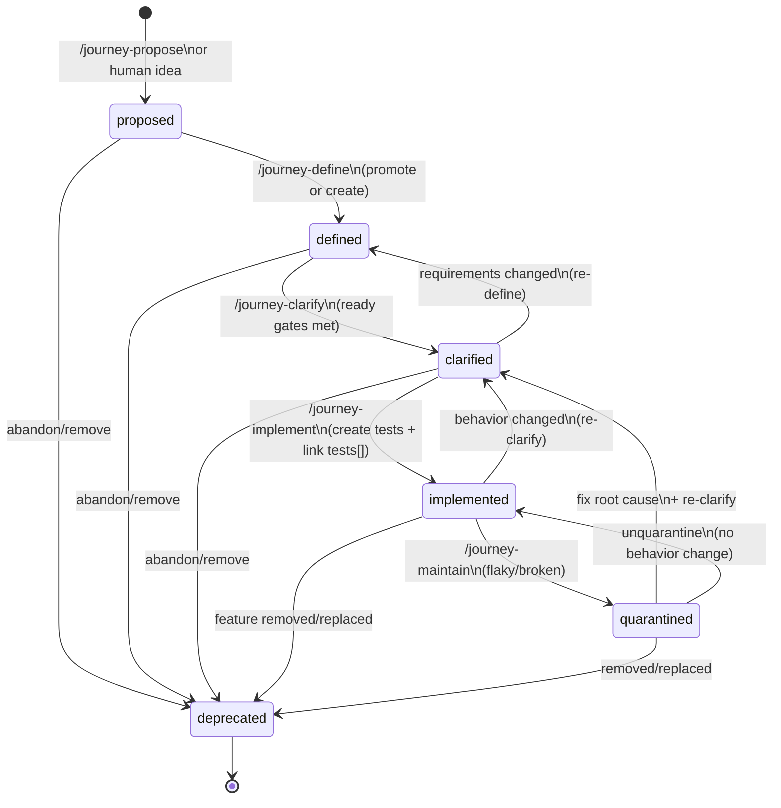

# ARTK Journey Lifecycle & State Machine (v0.1)

This document defines **all Journey states** in ARTK, what each state means, **what must be true** in that state, and **exactly how** a Journey transitions from one state to another.

If you want a regression system that doesn’t rot, the “state machine” is non-negotiable. Otherwise you get a backlog full of wishful thinking and a test suite full of lies.

---

## What is a Journey (and what it is not)

A **Journey** is a *human-readable* contract for an end-to-end scenario. It contains:

- **Intent**: why it exists (risk / user value).
- **Acceptance criteria**: declarative rules (Given/When/Then or equivalent).
- **Procedural UI steps**: the concrete “what a user does” walkthrough.
- **Testability + data strategy**: how we make this deterministic.
- **Dependencies**: which modules must exist to implement it.

A Journey is **not**:
- A Playwright test file.
- A page object.
- A list of selectors.
- A “ticket description with vibes.”

Journeys are the source of truth. Tests are the execution artifacts linked back to Journeys.

---

## Canonical Journey statuses (the states)

ARTK defines these **canonical statuses**:

1) `proposed`  
2) `defined`  
3) `clarified`  
4) `implemented`  
5) `quarantined`  
6) `deprecated`  

These statuses represent **maturity**, not priority. Priority comes from tier and risk scoring.

### Status vs Tier (don’t mix them)
- **Status** = how ready the Journey is.
- **Tier** = how important it is for gating/coverage (`smoke`, `release`, `regression`).

A Journey can be `status: proposed` and `tier: smoke` (important, but not ready yet).

---

## Lifecycle overview

### Normal “happy path” lifecycle
- **proposed** → **defined** → **clarified** → **implemented**

### Exceptional lifecycle paths
- Any state → **deprecated** (feature removed / replaced / abandoned)
- **implemented** → **quarantined** (flaky/broken/unreliable)
- **quarantined** → **clarified** or **implemented** (after fix)

---

## State machine diagram

### Core state machine (canonical)



### “Blocked” is not a status
ARTK treats **blocked** as an overlay condition, not a status:
- You can be `proposed`, `defined`, or even `clarified` but still blocked.
- Blocked is represented by:
  - `statusReason` (short), and
  - a “Blockers” section in the body.

Why? Because blocked Journeys still need to exist and be tracked.

---

## State definitions (exhaustive)

Below: what each status means, what must be present, and how you move to the next state.

### 1) `proposed`

**Meaning**: “We should probably test this.”  
This is a high-signal idea, not yet a deterministic plan.

**Typical creator**:
- `/journey-propose` (automatic)
- human proposal (manual authoring)

**Minimum required content**
- `id`, `title`, `status: proposed`, `tier`, `actor`, `scope`
- Body includes:
  - why it matters (risk/value)
  - high-level flow
  - open questions

**Allowed characteristics**
- May be incomplete.
- May contain unknowns.
- May be blocked.

**Exit criteria to `defined`**
- Has a stable goal and at least a minimal set of steps and assertions.
- Ambiguities are narrowed enough to produce a structured contract.

**Transitions**
- proposed → defined: `/journey-define`
- proposed → deprecated: abandoned/removed
- proposed → proposed: updated proposal or reprioritized (same state)

---

### 2) `defined`

**Meaning**: “We have a contract, but it’s not fully deterministic yet.”  
Defined Journeys have structure and intent, but still require clarification on data/env/assertions.

**Typical creator**
- `/journey-define` (from user input)
- `/journey-define source=<id>` (promote a proposed Journey)

**Minimum required content**
- Intent is explicit.
- Acceptance criteria exist (even if partially vague).
- Procedural steps exist (high-level allowed).
- Assertions exist (at least end-state and key checkpoints).
- Unknowns and blockers captured.

**Exit criteria to `clarified`**
- Actor/account assumptions are documented.
- Environment assumptions and accessibility are documented.
- Data strategy exists (setup + cleanup expectation).
- Assertions are explicit and stable.
- Async behavior risks are acknowledged.
- Compliance constraints for artifacts are documented.

**Transitions**
- defined → clarified: `/journey-clarify`
- defined → deprecated: abandoned/removed
- defined → defined: updated content without changing state

---

### 3) `clarified`

**Meaning**: “Implementation-ready, deterministic.”  
A clarified Journey is specific enough that `/journey-implement` can write tests **without guessing**.

**Typical creator**
- `/journey-clarify` (medium by default)

**Minimum required content**
- Actor role and how to obtain a test account (process, not credentials).
- Environment: base URLs, env names, access constraints (region/network).
- Data strategy:
  - how to create/seed/reuse data
  - cleanup expectations
  - uniqueness/run-id namespacing
- Assertions:
  - at least 3 explicit checks or equivalent checkpoints
  - stable signals (UI state, toasts, rows, URL change)
- Async notes:
  - what indicates completion (avoid blind sleeps)
  - eventual consistency risks
- Compliance constraints:
  - whether traces/videos/screenshots are allowed
  - PII constraints and retention policy
- Module dependency confirmation:
  - foundation module list
  - feature module list

**Exit criteria to `implemented`**
- Playwright tests exist and are linked.
- Journey is demonstrably executable with deterministic results.

**Transitions**
- clarified → implemented: `/journey-implement` (future phase)
- clarified → defined: requirements changed (rework)
- clarified → deprecated: abandoned/removed
- clarified → clarified: update details, still ready

---

### 4) `implemented`

**Meaning**: “The Journey is automated and enforced.”

**Hard rule**
- `implemented` requires `tests[]` links in frontmatter (non-empty).  
  Those links must point to the actual test file(s) or test IDs.

**Typical creator**
- `/journey-implement` (future phase)
- or manual implementation following ARTK harness conventions

**Expected characteristics**
- Tests are stable enough for repeated runs.
- Failures are actionable.
- Modules used are clean and reusable.

**Transitions**
- implemented → quarantined: if flaky or broken in a way that blocks releases
- implemented → clarified: if behavior changed and tests need redesign
- implemented → deprecated: feature removed/replaced

---

### 5) `quarantined`

**Meaning**: “We keep it, but we don’t trust it.”  
Quarantined is a **controlled failure state** used to prevent flaky tests from burning trust in the suite.

**Why quarantine exists**
- Flaky tests are worse than no tests because they train the team to ignore failures.

**Hard rules**
- Quarantined requires:
  - `owner`
  - `statusReason`
  - `links.issues[]` containing at least one issue/ticket explaining the failure and the plan.

**Expected characteristics**
- The test may be skipped or isolated.
- The Journey still exists for coverage accounting.
- The backlog still lists it, but it is clearly flagged.

**Transitions**
- quarantined → implemented: root cause fixed and reliability restored (no spec change)
- quarantined → clarified: spec rework is required (behavior changed or test strategy changed)
- quarantined → deprecated: feature removed

---

### 6) `deprecated`

**Meaning**: “No longer applicable.”  
Deprecated Journeys are kept for history and auditability.

**Hard rule**
- Deprecated requires `statusReason`.

**Typical reasons**
- feature removed
- flow replaced by a new flow
- compliance policy changed and automation is forbidden
- product direction abandoned

**Rules**
- Never reuse deprecated Journey IDs.
- If a similar flow returns later, create a new Journey ID.

**Transitions**
- deprecated is terminal (no reactivation). Create a new Journey instead.

---

## Transition map (commands + criteria)

| From | To | Primary command | File move (staged layout) | Gate/criteria |
|---|---|---|---|---|
| proposed | defined | `/journey-define` | proposed/ → defined/ | goal + steps + assertions + tier structured |
| defined | clarified | `/journey-clarify` | defined/ → clarified/ | actor/env/data/assertions/async/compliance done |
| clarified | implemented | `/journey-implement` | (optional) clarified/ → implemented/ | tests exist + linked in `tests[]` |
| implemented | quarantined | `/journey-maintain` | implemented/ → quarantined/ (optional) | flaky/broken, requires owner+issue |
| quarantined | implemented | `/journey-maintain` | quarantined/ → implemented/ | fixed, reliable, no spec change |
| quarantined | clarified | `/journey-clarify` | quarantined/ → clarified/ | needs re-clarification |
| any | deprecated | `/journey-maintain` (or manual) | → deprecated/ (optional) | feature removed or journey obsolete |

**Folder moves are optional.** ARTK cares about `status`, not directory. The folders exist to keep humans sane.

---

## Readiness checklists

### Ready for `defined`
- [ ] Goal is clear
- [ ] Steps exist (3–8)
- [ ] Assertions exist (2–6)
- [ ] Tier chosen
- [ ] Actor and scope are known or inferred
- [ ] Unknowns captured

### Ready for `clarified`
- [ ] Actor/account process documented
- [ ] Env/baseURL documented
- [ ] Data setup/cleanup strategy documented
- [ ] Assertions are explicit and stable
- [ ] Async risks documented (completion signals)
- [ ] Compliance constraints documented (PII/artifacts)
- [ ] Module dependencies confirmed

### Ready for `implemented`
- [ ] Tests exist and pass reliably
- [ ] Tests link back to Journey (`tests[]` and/or tags like `@JRN-####`)
- [ ] Tests use foundation harness (auth, config, locators)
- [ ] Failures are actionable (artifacts + logs are meaningful)

---

## Governance rules (because chaos is free)

### When to quarantine
Quarantine when:
- the test is flaky and blocks the team repeatedly
- the system is eventually consistent and assertions aren’t stabilized yet
- the environment is unstable and you can’t trust failures

Quarantine is not permission to ignore the problem forever. It’s a structured “we’re fixing this” label.

### When to deprecate
Deprecate when:
- the flow no longer exists
- the flow is replaced
- automating it is forbidden (policy)

Never delete journeys silently. History matters.

---

## Appendix A — Recommended status-driven folder layout (optional)

If you use `layout: staged`, recommended folders:

- `journeys/proposed/`
- `journeys/defined/`
- `journeys/clarified/`
- `journeys/quarantined/` (optional)
- `journeys/deprecated/` (optional)

Again: folders are for humans. Status is for machines.

---

## Appendix B — Example frontmatter per state

### Proposed
```yaml
id: JRN-0007
title: "User can log in and reach dashboard"
status: proposed
tier: smoke
actor: "standard-user"
scope: "auth"
tags: [proposed, smoke]
modules:
  foundation: [auth, navigation]
  feature: []
links:
  requirements: []
  issues: []
  docs: []
tests: []
```

### Implemented
```yaml
status: implemented
tests:
  - e2e/tests/smoke/login.spec.ts
  - e2e/tests/smoke/navigation.spec.ts
```

### Quarantined
```yaml
status: quarantined
owner: "team-auth"
statusReason: "Flaky due to async profile sync"
links:
  issues:
    - "JIRA-1234"
tests:
  - e2e/tests/smoke/login.spec.ts
```

### Deprecated
```yaml
status: deprecated
statusReason: "Legacy login removed; migrated to SSO"
tests: []
```

---

## Appendix C — Relationship between Journey and Test

A Journey becomes `implemented` when:
- tests exist, and
- they are linked from the Journey (`tests[]`) and/or tagged (`@JRN-####`), and
- they pass reliably under the harness constraints.

A test without a Journey is an orphan. Orphans get deleted when nobody remembers why they exist.
