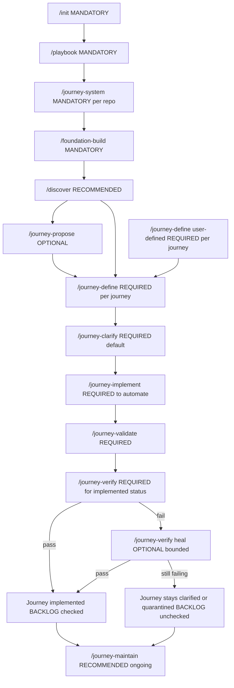
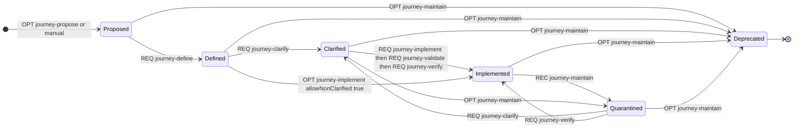

# Automatic Regression Testing Kit (ARTK)
## Master Launch Document (Playbook + Detailed Plan) v0.6

P25-12-25
> **Contains:** Launch Playbook + Detailed Phased Plan (merged, versioned as v0.6)

> **ARTK positioning:** ARTK is a **standardized kit that plugs into GitHub Copilot** (repository instructions + prompt files + structured artifacts) to help teams **build and keep up to date complete automated regression testing suites** for existing applications. Those suites cover critical end-to-end **Journeys** across the system, detect regressions early, and keep behavior stable and predictable across releases.


### Contents
1. Launch Playbook (Core Concepts, Definitions, Workflow)
2. Detailed Phased Implementation Plan (No CI/CD Yet)

---

## 1) Launch Playbook


## ARTK Core vs ARTK Project Instance

ARTK is designed as **one reusable Core** plus **per-repository Instances**:

- **ARTK Core (built once, versioned):** reusable standards + engine:
  - Canonical Journey schema (frontmatter fields, statuses, tiers)
  - Journey templates
  - Backlog/index generator + validator scripts
  - Baseline guardrail defaults and upgrade/migration notes

- **ARTK Project Instance (installed per repo):** integration + configuration:
  - Repo-specific `artk.config.yml` (auth category, artifact/PII policy, selector policy, tiers)
  - Repo paths/globs (`ARTK_ROOT`, monorepo app scope, where tests live)
  - Repo-specific generated outputs (Journey Backlog, index)
  - Repo-local Copilot instruction files and prompt workflows (slash commands)

**Why this split matters:** Core stays reusable and consistent across projects; Instances adapt to each repository’s structure/policies and produce the per-repo backlog/index that cannot be shared.

## Launch Playbook Document v0.1

> **Purpose:** This document is the single source of truth for launching
> ARTK, our Copilot-accelerated, modular Playwright regression testing system.
> It captures the concepts, definitions, artifacts, and workflow agreed
> upon to start implementing the initial structure, prompts, and files
> (no CI/CD yet).

------------------------------------------------------------------------

## 1) Problem Statement and Goal

### Current situation

-   Multiple in-house products with complex architecture
-   Multiple environments (intg / ctlq / prod), network-restricted
    access
-   No dedicated QA, frequent regression risk

### Goal

Build ARTK, a repeatable, scalable automated regression kit using: -
Playwright browser tests - GitHub Copilot with strong permanent
guardrails - Modular architecture (foundation + feature modules) -
Journey-driven testing - Slash-command based workflows

------------------------------------------------------------------------

## 2) Scope and Non-Goals

### In scope

-   Concepts, definitions, workflows
-   Journey lifecycle and backlog
-   Module strategy
-   Prompt and instruction system (structure only)

### Out of scope (for now)

-   CI/CD, deployment gating
-   Runner routing and environment access

------------------------------------------------------------------------

## 3) Core Ideas

1.  Journeys are contracts
2.  Tests implement journeys
3.  Modules make it maintainable

------------------------------------------------------------------------

## 4) Definitions

### Journey

Text-based durable definition of a regression scenario. Includes
metadata, actor, preconditions, steps, assertions, dependencies.

### Test

Executable Playwright code implementing one or more journeys.

### Module

Reusable test logic: - Pages (UI abstraction) - Flows (business actions)

### Foundation Modules

Global prerequisites: - Auth harness - Env/config loader - Navigation
helpers - Data harness scaffolding - Selector utilities

### Feature Modules

Created as journeys demand (orders, users, reporting, etc.).

------------------------------------------------------------------------

## 5) The Playbook

The Playbook defines permanent rules: - Architecture (pages → flows →
journeys) - Selector strategy - Flake policy - Test data expectations -
Definition of Done - Ownership expectations

Translated into: - Human-readable docs - Copilot instructions

------------------------------------------------------------------------

## 6) Journey Backlog

Two-layer model: 1. Canonical journey files (machine-friendly) 2.
BACKLOG.md (human-friendly checkboxes)

Automatically updated by all commands.

------------------------------------------------------------------------

## 7) Journey Structure

### Business Steps (authoritative)

Intent-level, stable steps.

### UI Interaction Outline (optional)

Click/type walkthrough for clarity, not authority.

------------------------------------------------------------------------

## 8) Repository Structure (Hint)

/e2e or /artk - /docs - /journeys - /src (pages, flows, utils) -
/tests - /.github (copilot instructions, prompts)

------------------------------------------------------------------------

## 9) Slash Command Workflow

This is the repo-level and journey-level command pipeline. Labels:
- **MANDATORY**: required for ARTK to function correctly
- **RECOMMENDED**: strongly advised for speed/quality
- **OPTIONAL**: used when it adds value for the repo/team

### Repo bootstrap commands

- **/init (MANDATORY)**  
  Scan the repository, detect stack and existing testing setup, ask only the *necessary* questions, then scaffold the ARTK root structure and configuration.

- **/playbook (MANDATORY)**  
  Generate the permanent, repo-local guardrails (Copilot instructions + docs) that define how ARTK code must be written, structured, and maintained.

- **/journey-system (MANDATORY per repo)**  
  Install or upgrade the Journey system from **ARTK Core** and generate the repo-local instance files (`journeys.config.yml`, `BACKLOG.md`, `index.json`, journey authoring instructions).

- **/foundation-build (MANDATORY)**  
  Create the Phase 7 Playwright harness baseline and ARTK foundation modules (env loader, auth setup project + storageState policy, navigation helpers, selector utilities, data harness scaffolding, module registry).

### Discovery + planning commands

- **/discover (RECOMMENDED)**  
  Produce a consistent, semi-automated view of routes/features/auth/testability/risk. Feeds better Journey proposals and reduces clarification questions later.

- **/journey-propose (OPTIONAL)**  
  Automatically propose high-signal Journeys from discovery outputs. Writes `journeys/proposed/*` and updates backlog/index.

### Journey authoring commands

- **/journey-define (REQUIRED per journey)**  
  Create or promote a Journey into canonical structure under `journeys/defined/*`. Works for both user-authored input and promoted proposals.

- **/journey-clarify (REQUIRED by default)**  
  Clarify a defined Journey to deterministic execution detail (medium by default). It should re-use discovery/testability outputs where possible so it doesn’t interrogate the user unnecessarily.

### Implementation + gates

- **/journey-implement (REQUIRED to automate)**  
  Generate/extend Playwright tests and feature modules for a clarified Journey, using the Phase 7 harness and module conventions.

- **/journey-validate (REQUIRED)**  
  Static validation gate: ensure the implementation respects ARTK technical rules (no hardcoded URLs, no `waitForTimeout`, proper tags/fixtures, module registry updates) and functional contract mapping (acceptance criteria coverage markers).

- **/journey-verify (REQUIRED for “implemented” status)**  
  Runtime verification gate: run Journey tests deterministically, capture artifacts, optionally run a bounded heal loop, and optionally run stability checks. Only after verify passes can a Journey be considered truly “implemented”.

- **/journey-maintain (RECOMMENDED ongoing)**  
  Keep the suite honest over time: quarantine flaky/broken tests, deprecate obsolete Journeys, update links and metadata, and keep backlog/index consistent.

### Diagrams

#### Command order pipeline (mandatory vs optional)



#### Journey status transitions mapped to commands




------------------------------------------------------------------------

## 10) Quality Rules (High-Level)

-   Modular architecture enforced
-   Stable selectors preferred
-   No brittle waits
-   Full traceability between journeys and tests

------------------------------------------------------------------------

## 11) Collaboration Model

-   AI accelerates, humans decide
-   Ownership is explicit
-   Broken tests are treated as serious failures

------------------------------------------------------------------------

## 12) What's Next

### Phase 1

-   Run /init on one representative product
-   Draft Playbook
-   Discover app surface
-   Propose initial journeys

### Phase 2

-   Run /foundation-build
-   Define, clarify, and implement 5--10 journeys

### Phase 3

-   Validate maintainability with /journey-maintain

### Phase 4 (later)

-   CI/CD and deployment integration

------------------------------------------------------------------------

## Definition of Done (Initial)

A Journey is “done” when:
- Journey file exists and is structured correctly
- Status is `implemented`
- Test paths are linked in Journey frontmatter `tests[]`
- Backlog checkbox is checked (generated backlog reflects implemented + tests links)
- Static gate passes: **/journey-validate** reports no violations
- Runtime gate passes: **/journey-verify** passes at least once in a supported environment
- (Recommended) Stability check passes (repeat run and/or flake detection policy)

---

## 2) Detailed Phased Implementation Plan

> **Scope of this plan:** Build the core ARTK solution (concepts, repository structure, journeys/backlog, module architecture, Copilot prompt system, and local-run readiness).
> **Explicitly out of scope (for later):** CI/CD gates, deployment orchestration, runner routing, Jube integration, and prod promotion logic.

---

## 0) Context and Objectives


### Core packaging note (applies to all phases)

To maximize reuse and reduce duplication across products, ARTK should converge on:
- a **versioned ARTK Core** (templates, schemas, generators, baseline rules), and
- a **repo-local ARTK Instance** (config + prompts + generated outputs).

Early pilots can start fully repo-local, but the implementation plan assumes we will rapidly extract shared pieces into ARTK Core so onboarding a new project becomes “install + configure”, not “reinvent”.

> **ARTK positioning:** ARTK is a **standardized kit that plugs into GitHub Copilot** (repository instructions + prompt files + structured artifacts) to help teams **build and keep up to date complete automated regression testing suites** for existing applications. Those suites cover critical end-to-end **Journeys** across the system, detect regressions early, and keep behavior stable and predictable across releases.

### Problem statement
- Multiple in-house products and complex architecture increase regression risk.
- No dedicated QA function means regressions are detected late, often after deployment.
- We need repeatable, maintainable, browser-level regression coverage with minimal manual overhead.

### Primary objective
Create ARTK: a **Copilot plug-in kit** (instructions + prompt files + artifacts) that helps teams build a **modular Playwright regression suite** driven by **Journeys** (text contracts). (text contracts) and delivered through **ARTK, a Copilot plug-in layer** (repo instructions + prompt files + standardized artifacts). (text contracts) and accelerated by **GitHub Copilot**, using a standardized set of **slash-command workflows** (e.g., `/init`, `/discover`, `/journey-propose`).

### Key success outcomes
- Teams can add and maintain regression coverage as part of normal development.
- Coverage is expressed and tracked as **Journeys implemented**, not just tests existing.
- The system is designed to be maintainable (selectors, flake policy, data determinism, modularity).
- Artifacts remain consistent and self-updating (Backlog and registries).

---

## 1) Definitions (Core Concepts)

### 1.1 Journey (contract)
A **Journey** is a durable, text-based definition of a regression scenario:
- **What/why**: business intent, not implementation trivia.
- **Steps**: both stable business steps and an optional UI interaction outline.
- **Assertions**: measurable outcomes that prove success.
- **Dependencies**: required modules (foundation + feature).
- **Lifecycle status**: proposed → defined → clarified → implemented → deprecated.
- **Traceability**: links to test file paths once implemented.

Journeys are first-class artifacts stored in the repo and are the unit used to discuss coverage.

### 1.2 Test (executable implementation)
A **Test** is the executable Playwright code that implements one or more Journeys.
- Journey = **what/why**
- Test = **how**

Mapping patterns:
- 1 journey → 1 test (typical for smoke)
- 1 journey → multiple tests (variants across roles/data)
- multiple journeys → 1 test (allowed but discouraged; reduces clarity)

### 1.3 Module (reusable building block)
ARTK uses a modular architecture:
- **Page Objects**: locators + low-level UI actions for a page/area.
- **Flows**: business actions composed from Page Objects (reusable steps).
- **Journeys/Tests**: composition of flows + assertions.

### 1.4 Foundation modules vs Feature modules
**Foundation modules** are global prerequisites built early:
- env/config loader
- auth harness scaffolding
- navigation shell helpers
- selector utilities
- data harness scaffolding

**Feature modules** are built as Journeys demand (e.g., orders, users, reporting).

### 1.5 Playbook (permanent guardrails)
The **Playbook** is the stable set of rules that all generated and human-written code must follow:
- architecture rules (pages → flows → tests)
- locator strategy and test-id policy
- flake policy (no brittle waits/sleeps by default)
- test data determinism expectations
- Definition of Done
- maintenance expectations and ownership

The Playbook is maintained as documentation, and distilled into Copilot instructions.

### 1.6 Journey Backlog (auto-maintained checklist)
The **Journey Backlog** is a human-readable checklist with checkboxes:
- `[ ]` not implemented
- `[x]` implemented

To avoid merge conflicts and enable automation, the backlog is generated from **canonical per-journey files**.

---

## 2) Repository Artifacts and Structure (Target)

> Final structure may be monorepo or dedicated repo, but the internal layout is consistent.

Suggested structure:

```
e2e/ (or artk/)
  docs/
    PLAYBOOK.md
    ARCHITECTURE.md
    JOURNEYS.md
    MODULES.md
    MAINTENANCE.md
    PROMPTS.md              # fallback prompt text for non-supported IDEs
    PILOT.md                # pilot scope & constraints
    DISCOVERY.md            # generated or maintained report
    JOURNEY_PROPOSALS.md    # generated summary after /journey-propose
  journeys/
    BACKLOG.md              # generated
    proposed/
    defined/
    clarified/
    deprecated/
    _templates/
      journey.template.md
  src/
    config/
    fixtures/
    pages/
    flows/
    assertions/
    data/
    utils/
  tests/
    journeys/
      smoke/
      release/
      regression/
  .github/
    copilot-instructions.md
    instructions/           # optional path-scoped instructions
    prompts/                # prompt files for slash-command workflows
```

### 2.1 Canonical journey file format
- Markdown file with YAML frontmatter (machine-parseable).
- Sections include goal, preconditions, steps (business + optional UI outline), assertions, postconditions, risks.

### 2.2 Backlog generation invariants
Any command that creates/updates journeys must:
- update canonical journey file(s)
- regenerate `journeys/BACKLOG.md`
- update module registry if dependencies changed
- keep test links consistent

---

## 3) slash-command workflows (ARTK Workflows)

Commands are implemented as Copilot prompt files (and documented fallback text). Prompt files are stored in `.github/prompts` and can be invoked as slash-command workflows in supported IDEs. GitHub documents prompt files in `.github/prompts/*.prompt.md`.
See references: GitHub Docs “Prompt files” and VS Code “Use prompt files”.

### Command set
- `/init`
- `/playbook`
- `/discover`
- `/journey-propose`
- `/journey-define`
- `/journey-clarify` (medium by default; supports minimal/max)
- `/foundation-build`
- `/journey-implement`
- `/journey-maintain`

---

## 4) Phase Plan (Extremely Detailed)

## Phase 0 — Pilot Selection and Readiness

### Objective
Choose a pilot product and validate baseline feasibility (auth, data, selectors) to avoid a stalled rollout.

### Tasks
1. **Select pilot app**
   - Representative architecture (not the easiest unicorn).
   - Active development stream (so value is immediate).
   - A stable non-prod environment exists for local testing.

2. **Define pilot scope**
   - Target environment for local execution (e.g., ctlq or intg).
   - Initial suite tiers used locally: smoke + release (regression reserved for later).
   - Initial roles: 1–2 roles only (e.g., basic user + admin).

3. **Auth feasibility checkpoint**
   - Identify auth type(s) used (LDAP/SSO redirect, forms, token-based).
   - Determine if non-prod has MFA/captcha.
   - Confirm there are or can be created **automation-friendly test accounts**.

4. **Test data feasibility checkpoint**
   - Can tests create data via API or UI?
   - Is there a safe cleanup path?
   - Identify shared mutable data risks and isolate them (namespace by run id).

5. **Selector readiness checkpoint**
   - Assess presence of stable selectors (`data-testid` or accessibility locators).
   - If missing, create a backlog of “add test hooks” tasks.

### Deliverables
- `docs/PILOT.md`: pilot scope, constraints, assumptions.
- `docs/AUTH.md` (optional): initial auth strategy notes.
- `docs/DATA.md` (optional): initial data strategy notes.
- `docs/SELECTORS.md` (optional): selector readiness and remediation backlog.

### Acceptance criteria
- Pilot app is testable under documented assumptions.
- Known blockers are listed with owners and mitigation options.

---

## Phase 1 — Skeleton Bootstrap (/init design and baseline repo structure)

### Objective
Create an “empty but correct” ARTK skeleton that future commands and automation can reliably build on.

### Tasks
1. **Decide repo placement**
   - Option A: `e2e/` folder inside the product repo.
   - Option B: dedicated `artk-e2e/` repo targeting product via baseURL.
   - Document the choice and rationale in `docs/ARCHITECTURE.md`.

2. **Create baseline folder structure**
   - `docs/`, `journeys/`, `src/`, `tests/`, `.github/` as per target layout.
   - Commit as the first foundational change.

3. **Define `/init` scanning checklist**
   `/init` must scan for:
   - application type (SPA/SSR/multi-app)
   - route sources (router config, server routes, nav definitions)
   - existing testing frameworks (Cypress/Selenium)
   - configuration patterns (`.env`, config files, runtime config endpoints)
   - auth hints (login routes, SSO redirects, OAuth clients)
   - selector readiness (`data-testid`, aria usage)

4. **Define `/init` questions catalog (asked AFTER scan)**
   `/init` asks targeted questions:
   - which environment to target first (baseURL)
   - which roles to support first (1–2)
   - test data strategy preference (create vs seed vs reuse)
   - compliance constraints (PII in screenshots/traces)
   - initial MVP scope (how many smoke/release journeys)

5. **Define `/init` outputs**
   `/init` must generate:
   - initial docs skeleton (Playbook outline, Journeys schema outline)
   - journey directories + template file
   - `.github/copilot-instructions.md` placeholder
   - `.github/prompts/` placeholders for each command
   - `docs/PROMPTS.md` fallback (for developers whose IDE does not support prompt files)

### Deliverables
- Skeleton committed with placeholder docs and directories.
- Journey template in `journeys/_templates/journey.template.md`.
- `.github/prompts/*.prompt.md` placeholders (contents minimal for now; structure established).

### Acceptance criteria
- Repo has a stable structure and “source of truth” doc entry points.
- Teams can run basic Playwright install and a no-op test skeleton locally (even if not meaningful yet).

---

## Phase 2 — Playbook + Permanent Guardrails (Copilot Instructions)

### Objective
Lock in non-negotiables before large-scale generation begins.

### Tasks
1. **Write `docs/PLAYBOOK.md` v1**
   Must include:
   - definitions: journey vs test vs module
   - architecture rules (pages → flows → tests)
   - selector strategy priority order
   - flake policy (no fixed sleeps by default; prefer assertions and auto-wait)
   - test data determinism expectations
   - Definition of Done
   - ownership expectations (who fixes broken tests)

2. **Create `.github/copilot-instructions.md`**
   GitHub supports repository custom instructions stored in `.github/copilot-instructions.md`.
   This file must distill Playbook rules into actionable generation constraints.

3. **Optional: create path-scoped instruction files**
   For more targeted behavior, use `.github/instructions/*.instructions.md` with `applyTo` path globs (supported by Copilot coding agent and Copilot code review per GitHub changelog updates).
   Example scopes:
   - `e2e/**` strict test rules
   - `journeys/**` journey formatting rules

4. **Define “prompt files + fallback” policy**
   - Prompt files are stored at `.github/prompts/*.prompt.md` (slash-command workflows in supported IDEs).
   - Also maintain `docs/PROMPTS.md` with copy/paste equivalents.

### Deliverables
- `docs/PLAYBOOK.md` (v1).
- `.github/copilot-instructions.md` (v1).
- `.github/instructions/` optional instruction files.
- `docs/PROMPTS.md` fallback.

### Acceptance criteria
- A developer can read Playbook and produce compliant modules/tests.
- Copilot-generated output follows the house rules by default.

---

## Phase 3 — Journey System + Backlog Automation (Core + Instance) (Core + Instance)

### Objective
Create a **Journey system of record** that stays consistent across repositories, while generating a **repo-specific backlog and index** automatically.

### Core decision
- Publish/maintain **ARTK Core** once (versioned).
- Each repository uses an installer-style command (e.g., `/journey-system`) to **install or upgrade** the Journey system from Core and adapt it to the repo.

### What “ARTK Core” contains (reusable, shared)
- Canonical Journey schema (frontmatter fields + allowed statuses/tiers)
- Journey templates (defined/proposed)
- Backlog + index generator and validator scripts
- Minimal upgrade/migration guidance between Core versions

### What each repo “ARTK Instance” contains (repo-local)
- `<ARTK_ROOT>/journeys/journeys.config.yml` (ID scheme, tiers, layout, link policies, app scopes)
- Repo-local wrapper scripts to run generator/validator (no CI yet)
- Generated outputs (must live in the repo):
  - `journeys/BACKLOG.md` (checkbox list derived from status + tests[])
  - `journeys/index.json` (machine index consumed by other ARTK commands)
- Copilot instructions for Journey authoring (`.github/instructions/artk-journeys.instructions.md`)

### Tasks
1) **Define canonical Journey schema + lifecycle**
   - statuses: proposed → defined → clarified → implemented (+ quarantined, deprecated)
   - implemented requires `tests[]` links; quarantined requires owner + issue link
2) **Define “two-layer” Journey writing standard**
   - Declarative acceptance criteria (authoritative contract)
   - Procedural UI steps (implementation guidance)
3) **Define traceability conventions**
   - Journey ID tag in tests (e.g., `@JRN-0001`) + optional annotation
4) **Backlog generation rules**
   - `BACKLOG.md` is generated; never edited by hand
   - `[x]` when implemented and tests[] non-empty; `[ ]` otherwise
   - include tier/status, link to Journey file, and linked tests
5) **Implement local generator + validator (from Core)**
   - deterministic ordering
   - duplicate ID detection
   - schema validation errors are actionable

### Deliverables
- ARTK Core (versioned) assets for Journeys (schema/templates/generator/validator)
- Repo-local Journey config + generated backlog/index
- Docs: `journeys/README.md` explaining lifecycle + mapping to tests

### Acceptance criteria
- Backlog and index can be regenerated deterministically from Journey files.
- Journey files alone are sufficient to drive module/test planning and coverage governance.


## Phase 4 — Discovery Capability (/discover)

### Objective
Create a consistent, semi-automated view of the application: routes, features, auth, testability, and risk.

### Tasks
1. **Define `/discover` outputs**
   Produce:
   - route/page inventory
   - feature area grouping
   - auth entry points
   - testability findings (selectors, data feasibility, async risk zones)
   - recommended initial smoke/release journeys (shortlist)

2. **Define scan sources**
   Depending on stack:
   - frontend router + navigation configuration
   - API client and endpoints usage
   - feature flags and permissions mapping
   - existing tests or mocks

3. **Define risk ranking model**
   Rank by:
   - shared component usage (header/nav/forms)
   - business criticality (if known)
   - complexity (multi-step flows, async approvals)
   - likely instability (eventual consistency, background jobs)

4. **Define doc format**
   Keep it readable:
   - executive summary
   - route table
   - “Top risk flows” list
   - “Blockers and remediation” list

### Deliverables
- `docs/DISCOVERY.md` (generated shape and/or first report).
- `docs/TESTABILITY.md` (if split makes sense).

### Acceptance criteria
- `/discover` output guides journey proposal and module planning.
- Known blockers are captured early, not discovered during test writing.

---

## Phase 5 — Automatic Journey Identification (/journey-propose)

### Objective
Generate a high-signal proposed journey backlog with module dependency hints.

### Tasks
1. **Define journey proposal heuristics**
   Use discovery data to propose:
   - critical “happy path” journeys first (login, navigation, core workflows)
   - cross-cutting flows (search, export, approvals)
   - keep edge cases for later unless they are high-risk

2. **Define ranking rules**
   Sort proposals by:
   - risk/criticality
   - feasibility (avoid proposing untestable journeys first)
   - reuse potential (journeys that demand reusable modules)

3. **Module impact analysis**
   For each proposed journey, identify:
   - foundation module dependencies
   - feature module dependencies
   - whether feature modules likely already exist or need scaffolding
   - complexity estimate: low/medium/high

4. **Outputs and artifacts**
   `/journey-propose` must:
   - create canonical journey files under `journeys/proposed/`
   - set status `proposed`
   - regenerate backlog
   - generate summary: `docs/JOURNEY_PROPOSALS.md`

### Deliverables
- Proposed journeys (files).
- Updated backlog.
- Proposal summary document.

### Acceptance criteria
- Proposed journeys are actionable and understandable.
- Each proposed journey contains at least: goal, business steps, tentative assertions, dependencies.

---

## Phase 6 — User-defined Journeys (/journey-define) and Clarification (/journey-clarify)

### Objective
Support both auto-proposed journeys and human-authored journeys, then clarify them to execution-ready detail **with minimal user fatigue** by reusing discovery/testability outputs whenever available.

### Tasks
1. **Define `/journey-define` input contract**
   The user provides:
   - goal
   - business steps (at minimum)
   - expected assertions
   - tier suggestion (`smoke`/`release`/`regression`)
   The system converts this into canonical structure and stores it under `journeys/defined/`.

   **Discovery-aware behavior (recommended):**
   - If `/discover` outputs exist, prefill likely scope/routes/modules, and ask only for confirmation when ambiguous.

2. **Define `/journey-clarify` (medium by default)**
   Medium mode collects enough detail for deterministic execution:
   - actor/role specifics (how to obtain accounts, never credentials)
   - environment assumptions (env names, baseURL mapping, access constraints)
   - data strategy: create/seed/reuse and cleanup expectations
   - explicit success criteria (acceptance criteria must be assertable)
   - known async behavior and completion signals (avoid timing sleeps)
   - compliance constraints (PII in traces/videos/screenshots, retention expectations)

   **Modes:**
   - `minimal`: only blockers and missing prerequisites
   - `medium` (default): execution-ready detail for implementation
   - `max`: deeper exploration (variants, negative paths, edge cases)

   **Discovery-aware behavior (required when available):**
   - Pull selectors/test-id conventions, known async risk zones, and feasibility notes from `docs/TESTABILITY.md` and discovery outputs.
   - Reduce questions by treating discovery findings as defaults and asking for confirmation only when needed.

3. **Clarify outputs**
   - update Journey file status to `clarified` when ready
   - regenerate backlog/index
   - record blockers as an overlay (not a status): `statusReason` + Blockers section

### Deliverables
- Clarified journeys ready for implementation.
- `docs/JOURNEY_CLARIFY.md` (guidance and examples).

### Acceptance criteria
- A clarified journey is sufficient for `/journey-implement` to implement without guessing key details.


---

## Phase 7 — Foundation Build (/foundation-build) + Playwright Baseline Harness

### Objective
Create global prerequisites once, so feature modules and tests remain consistent.

### Tasks
1. **Playwright baseline configuration**
   Establish:
   - consistent test directory structure (tiers + setup)
   - baseURL support via config loader (no hardcoded URLs)
   - local reporters and artifact locations (report vs output separated)
   - standard timeouts and retries (local defaults; CI tuned later)

2. **Auth harness**
   Prefer Playwright **project dependencies** for setup because it integrates into reports, traces, and fixtures.
   Design approach:
   - a “setup” project logs in (UI or API) and writes storage state
   - test projects depend on setup and reuse the storage state
   - storage state is written under an ignored directory (never committed)

3. **Environment/config loader**
   A single place to configure:
   - baseURL
   - environment name (e.g., `intg`, `ctlq`)
   - placeholders for region/network zone (for later runner routing)
   - safe logging of resolved config (no secrets)

4. **Navigation helpers**
   Standardize global navigation patterns:
   - opening menus
   - switching contexts/areas
   - basic “goto area” primitives (thin, composable helpers)

5. **Selector utilities**
   Provide:
   - helper wrappers for consistent locator usage (role/name/label first)
   - test-id conventions (if available) and `testIdAttribute` alignment
   - guidance for requesting new test hooks when missing

6. **Data harness scaffolding**
   Even before the final strategy is chosen, define:
   - builders (DTOs and UI fill models)
   - seed strategy placeholders (API calls or fixtures)
   - cleanup strategy placeholders
   - run-id namespacing convention to avoid collisions

7. **Module registry**
   Create a module registry file and keep it updated:
   - foundation modules list (present after this phase)
   - feature modules list (initially empty)
   - placeholder mapping for Journey → module dependencies (populated as Journeys are implemented)

### Deliverables
- Foundation scaffolding committed (harness + modules + config loader).
- `docs/FOUNDATION.md` describing how to use it locally.
- Module registry created and updated.

### Acceptance criteria
- Local run can:
   - launch browser
   - reach baseURL reliably
   - reuse storageState for an “authenticated check” when auth is configured
- The harness enforces “no hardcoded URLs” and consistent artifact locations.


---

## Phase 8 — Implement MVP Journeys (/journey-implement) + Validation (/journey-validate) + Verification (/journey-verify)

### Objective
Implement the first set of Journeys with clean modular architecture, full traceability, and **proof that the generated tests actually work**.

### Key principle
A Journey is not “implemented” because code exists. It is implemented only when:
- tests exist and are linked (`tests[]`), **and**
- `/journey-validate` passes, **and**
- `/journey-verify` passes at least once in a supported environment.

### Tasks
1. **Select MVP journey set**
   Recommended starting scope:
   - 2–3 smoke journeys (app alive + critical navigation)
   - 3–7 release journeys (core business flows)

2. **Define `/journey-implement` behavior (generator)**
   For each selected Journey:
   - confirm Journey is `clarified` (or apply policy: allow skeleton only when explicitly permitted)
   - ensure foundation modules exist (require `/foundation-build` if missing)
   - scaffold or extend required feature modules (thin “screen/task” helpers, not POM bloat)
   - generate Playwright tests with mandatory tags:
     - `@JRN-####`, tier tag, scope tag
   - map acceptance criteria to explicit assertions and/or `test.step` markers
   - update module registry dependency mapping
   - update Journey `tests[]` links

3. **Add `/journey-validate` static gate (mandatory)**
   Validate that implementation respects ARTK rules:
   - no hardcoded URLs
   - no `page.waitForTimeout()` without justified exception policy
   - no focused tests (`.only`) and no interactive pauses left behind
   - correct harness fixture usage (import base `test` from harness)
   - tags present and consistent with policy
   - module registry updated
   - functional contract mapping: each acceptance criterion is covered by at least one assertion marker

   Output a validation report per Journey and optionally annotate Journey with validation status metadata.

4. **Add `/journey-verify` runtime gate (mandatory for implemented status)**
   Run the Journey tests deterministically:
   - filter by tag (`--grep @JRN-####`)
   - run single-worker for debugging determinism
   - fail fast on first failure for fast iteration
   - capture artifacts on failure (trace/screenshots/video per policy)
   - output machine-readable results for the heal loop

   **Optional bounded heal loop**:
   - attempt a limited number of repair iterations
   - allowed fixes: locator refinement, explicit completion signals, data namespacing, robust waits
   - forbidden fixes: deleting assertions, weakening contracts, adding blind sleeps as “stability”
   - if still failing: keep Journey non-implemented and record actionable diagnosis + artifact paths

   **Optional stability check**:
   - repeat the Journey run (`--repeat-each`) and/or fail on flaky behavior per policy

5. **Update Journey status correctly**
   - Only set Journey `status: implemented` when validate + verify pass and `tests[]` is non-empty.
   - If unstable: quarantine via `/journey-maintain` (do not pretend it’s implemented).

### Deliverables
- Implemented smoke/release Journeys with linked tests.
- Validation reports (`docs/validation/*` or equivalent).
- Verification reports and artifacts (`docs/verification/*` and artifact folders).
- Updated module registry and backlog/index.

### Acceptance criteria
- Journeys marked implemented are runnable and pass (not theoretical).
- The system self-reports rule violations and keeps backlog accurate.
- Failure artifacts are sufficient to debug without guesswork.


---

## Phase 9 — Maintenance Capability (/journey-maintain)

### Objective
Prevent suite rot by making maintenance an explicit workflow from day one.

### What maintenance must do (concrete)
1. **Drift detection**
   - journey marked implemented but tests are missing at referenced paths
   - tests exist but no journey references them
   - tests reference non-existent journey IDs

2. **Flake smell detection**
   - fixed sleeps/timeouts usage
   - brittle locators
   - hidden dependency on shared mutable data

3. **Duplication detection**
   - repeated flows and page patterns
   - duplicated locators across modules
   - multiple “helper” utilities solving the same problem

4. **Deprecation handling**
   - move obsolete journeys to `deprecated/`
   - keep history but remove from active backlog sections

5. **Backlog and registry reconciliation**
   Always regenerate backlog and update registries to match ground truth.

### Deliverables
- `docs/MAINTENANCE.md` and an example maintain report format.
- A standard “maintenance report” artifact (e.g., `reports/maintain-YYYY-MM-DD.md`) documented for later automation.

### Acceptance criteria
- The system self-reports inconsistencies and keeps backlog accurate.
- Flakiness and duplication trends are visible and actionable.

---

## Phase 10 — Multi-Product Rollout (Repeatable Onboarding)

### Objective
Make onboarding a new product predictable and fast.

### Tasks
1. **Standard onboarding workflow**
   - `/init`
   - `/playbook` (reuse global playbook + per-product supplements)
   - `/discover`
   - `/journey-propose`
   - select MVP journeys
   - `/foundation-build` (shared or per product)
   - implement MVP journeys

2. **Global vs local standards**
   Decide what is universal:
   - playbook rules
   - journey schema
   - module structure

   And what is per-product:
   - auth specifics
   - data setup specifics
   - environment naming and navigation quirks

3. **Governance**
   - CODEOWNERS for `e2e/` area
   - PR checklist: new features require journey update or justification
   - explicit ownership per journey (who fixes when broken)

### Deliverables
- `docs/ONBOARDING.md` for new products.
- templates for per-product supplements (`docs/PRODUCT_SUPPLEMENTS/` if needed).

### Acceptance criteria
- Second product onboarding requires minimal new invention.
- Same command workflow produces consistent artifacts.

---

## 5) Cross-Phase Design: Prompt System and Guardrails

### 5.1 Prompt files (slash-command workflows)
Prompt files are reusable templates for Copilot Chat stored under `.github/prompts` with `.prompt.md` extension. GitHub documents prompt files and how to use them; VS Code also documents using prompt files in Copilot Chat.

Planned prompt file list:
- `.github/prompts/init.prompt.md`
- `.github/prompts/playbook.prompt.md`
- `.github/prompts/discover.prompt.md`
- `.github/prompts/journey-propose.prompt.md`
- `.github/prompts/journey-define.prompt.md`
- `.github/prompts/journey-clarify.prompt.md`
- `.github/prompts/foundation-build.prompt.md`
- `.github/prompts/journey-implement.prompt.md`
- `.github/prompts/journey-maintain.prompt.md`

Standard structure (each prompt):
- YAML frontmatter: mode/description (as supported)
- Inputs section (if any)
- Process steps (scan → ask → write → update backlog/registry)
- Outputs section (files to create/update)
- Invariants section (must regenerate backlog, must update journey metadata)

### 5.2 Fallback for non-supported IDEs
Prompt files availability can vary by IDE; maintain `docs/PROMPTS.md` as copy/paste equivalents for consistent access across teams.

### 5.3 Repository custom instructions
Use `.github/copilot-instructions.md` to provide repo-wide instructions that Copilot automatically uses as context.

### 5.4 Path-scoped instructions (optional)
Use `.github/instructions/*.instructions.md` with `applyTo` path globs to scope instructions to specific folders (e.g., `e2e/**`, `journeys/**`).

---

## 6) Risk Register (Early)

- **Auth automation blocked by MFA or SSO constraints**
  - Mitigation: automation-friendly non-prod accounts, approved token/session paths.
- **No stable selectors**
  - Mitigation: establish test-id strategy; create backlog to add hooks.
- **Non-deterministic test data**
  - Mitigation: data harness scaffolding early; namespace and cleanup strategy.
- **Suite rot without maintenance**
  - Mitigation: `/journey-maintain` from day one; ownership rules.
- **Prompt file feature differences across IDEs**
  - Mitigation: maintain fallback prompts in docs.

---

## 7) Execution Order (Recommended for Pilot)

1. Phase 0 — pilot readiness (auth/data/selectors)
2. Phase 1 — skeleton bootstrap
3. Phase 2 — Playbook + Copilot guardrails
4. Phase 3 — journey schema + backlog automation spec
5. Phase 4 — discovery output and first discovery run
6. Phase 5 — journey proposals and initial backlog
7. Phase 6 — define + clarify selected MVP journeys
8. Phase 7 — foundation build
9. Phase 8 — implement MVP journeys and feature modules
10. Phase 9 — maintain pass and hardening
11. Phase 10 — onboard a second product to validate repeatability

---

## References
- GitHub Docs: Prompt files — https://docs.github.com/en/copilot/tutorials/customization-library/prompt-files citeturn0search0
- VS Code Docs: Use prompt files — https://code.visualstudio.com/docs/copilot/customization/prompt-files citeturn0search3
- GitHub Docs: Add repository custom instructions — https://docs.github.com/en/copilot/how-tos/configure-custom-instructions/add-repository-instructions citeturn0search1
- GitHub Changelog: Support for `.github/instructions/*.instructions.md` with path scoping — https://github.blog/changelog/2025-07-23-github-copilot-coding-agent-now-supports-instructions-md-custom-instructions/ citeturn0search4
- GitHub Changelog: Copilot code review path-scoped instruction support (applyTo globs) — https://github.blog/changelog/2025-09-03-copilot-code-review-path-scoped-custom-instruction-file-support/ citeturn0search5
- Playwright Docs: Global setup and teardown (project dependencies recommended) — https://playwright.dev/docs/test-global-setup-teardown citeturn0search2
